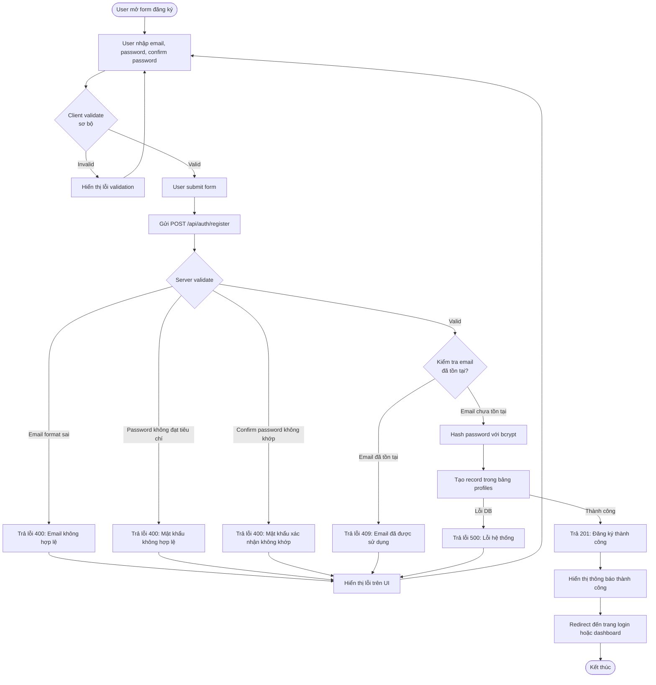

# 1.1 User Registration Flow

## Mô tả
Flow đăng ký tài khoản mới bằng email và mật khẩu.

## Flowchart

## Luồng chính (Happy Path)
1. User mở form đăng ký
2. User nhập email, password, confirm password
3. Client validate sơ bộ (format email, độ dài password)
4. User submit form
5. Server validate dữ liệu
6. Server kiểm tra email chưa tồn tại
7. Server hash password
8. Server tạo profile mới
9. Trả về thông báo thành công
10. Redirect đến trang login hoặc dashboard

## Luồng lỗi
- Email format không hợp lệ → 400 Bad Request
- Password không đạt tiêu chí (tối thiểu 8 ký tự) → 400 Bad Request
- Confirm password không khớp → 400 Bad Request
- Email đã tồn tại → 409 Conflict
- Lỗi database → 500 Internal Server Error
- Lỗi mạng → Hiển thị thông báo thân thiện

## Validation Rules
- Email: định dạng hợp lệ, lowercase, unique
- Password: tối thiểu 8 ký tự, nên có chữ thường/hoa/số/ký tự đặc biệt
- Confirm password: phải khớp với password

