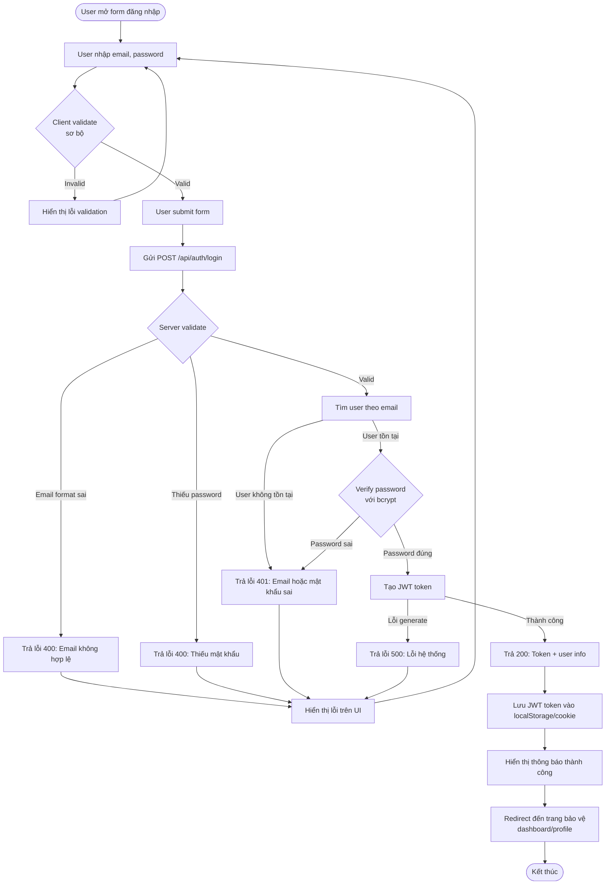

# 1.2 User Login Flow

## Mô tả
Flow đăng nhập bằng email và mật khẩu, trả về JWT token.

## Flowchart

## Luồng chính (Happy Path)
1. User mở form đăng nhập
2. User nhập email và password
3. Client validate sơ bộ
4. User submit form
5. Server validate dữ liệu
6. Server tìm user theo email
7. Server verify password với bcrypt
8. Server generate JWT token
9. Server trả về token và user info
10. Client lưu token vào localStorage/cookie
11. Redirect đến trang bảo vệ (dashboard/profile)

## Luồng lỗi
- Email format không hợp lệ → 400 Bad Request
- Thiếu password → 400 Bad Request
- Email không tồn tại → 401 Unauthorized (không tiết lộ email có tồn tại)
- Password sai → 401 Unauthorized
- Lỗi generate token → 500 Internal Server Error
- Lỗi mạng → Hiển thị thông báo thân thiện

## Security Notes
- Không tiết lộ email có tồn tại hay không (trả cùng lỗi 401)
- JWT token có TTL hợp lý (ví dụ: 24h)
- Token được lưu an toàn (có thể dùng httpOnly cookie)
- Không log plaintext password

