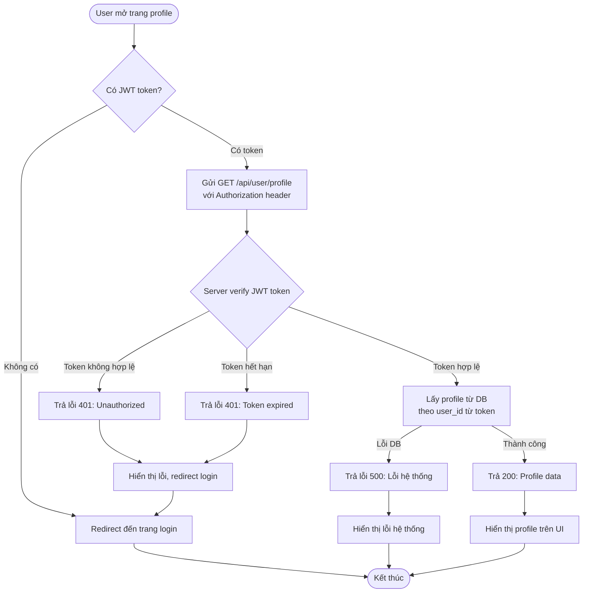
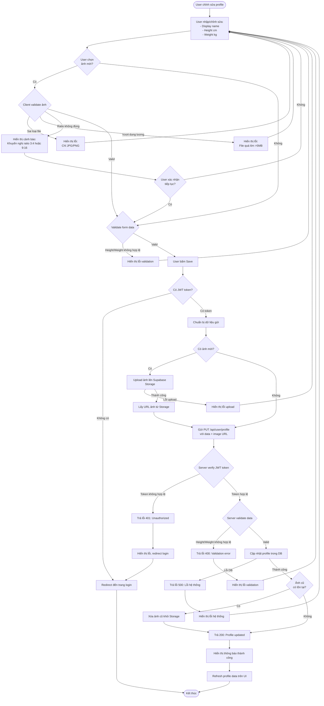

# 1.3 Profile Get/Update Flow

## Mô tả
Flow lấy và cập nhật thông tin profile, bao gồm upload ảnh toàn thân vào Supabase Storage.

## Flowchart - Get Profile

## Flowchart - Update Profile

## Luồng chính - Get Profile
1. User mở trang profile
2. Client kiểm tra có JWT token
3. Gửi GET request với Authorization header
4. Server verify JWT token
5. Server lấy profile từ DB
6. Trả về profile data
7. Client hiển thị profile

## Luồng chính - Update Profile
1. User chỉnh sửa thông tin (name, height, weight)
2. User chọn ảnh mới (nếu có)
3. Client validate ảnh (loại file, dung lượng, ratio)
4. Client validate form data
5. User bấm Save
6. Nếu có ảnh mới: Upload lên Supabase Storage
7. Gửi PUT request với data và image URL
8. Server verify JWT token
9. Server validate data
10. Server cập nhật profile trong DB
11. Xóa ảnh cũ nếu có
12. Trả về kết quả thành công
13. Client refresh UI

## Luồng lỗi
- Không có token hoặc token không hợp lệ → 401, redirect login
- Token hết hạn → 401, yêu cầu đăng nhập lại
- Ảnh sai loại (không phải JPG/PNG) → Hiển thị lỗi
- Ảnh vượt dung lượng (>5MB) → Hiển thị lỗi
- Ảnh ratio không đúng → Cảnh báo (không chặn)
- Height/Weight không hợp lệ → 400 Bad Request
- Lỗi upload Storage → Hiển thị lỗi
- Lỗi database → 500 Internal Server Error

## Validation Rules
- Height (cm): số, 100-250
- Weight (kg): số, 30-250
- Ảnh: JPG/JPEG/PNG, ≤5MB, ratio khuyến nghị 3:4 hoặc 9:16, min dimension ≥720px
- Email: hiển thị từ profile, không chỉnh sửa

