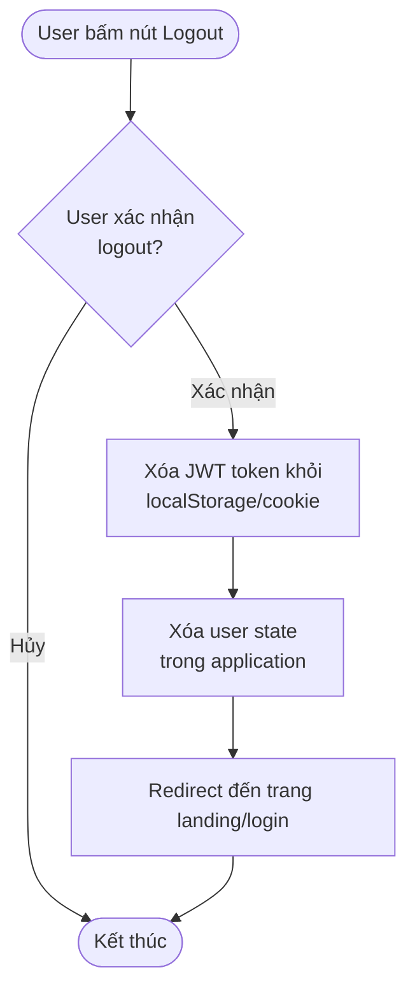
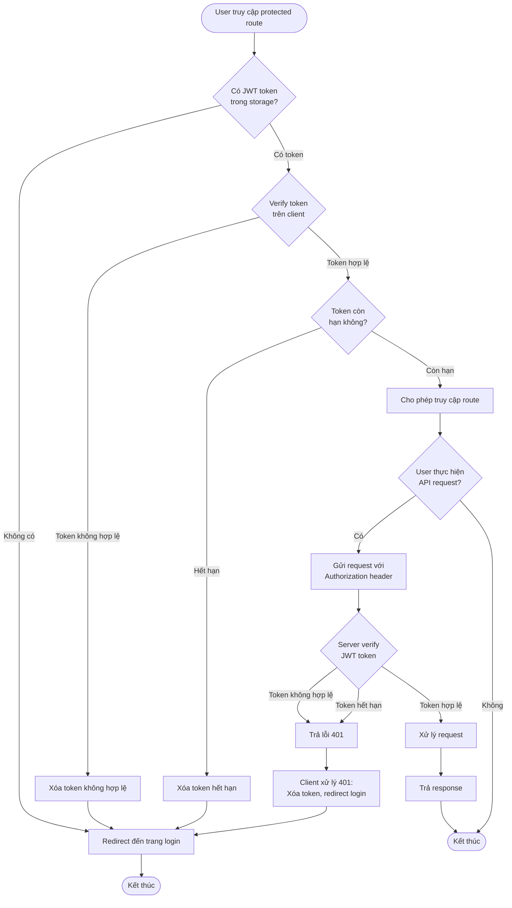

# 1.4 Logout & Protected Routes Flow

## Mô tả
Flow logout và bảo vệ các routes yêu cầu đăng nhập.

## Flowchart - Logout



## Flowchart - Protected Routes



## Flowchart - API Middleware Protection

```mermaid
flowchart TD
    Start([API Request đến protected endpoint]) --> ExtractToken[Extract JWT token<br/>từ Authorization header]
    ExtractToken --> HasToken{Có token?}
    HasToken -->|Không có| Return401_1[Trả lỗi 401:<br/>Missing token]
    HasToken -->|Có| VerifyJWT{Verify JWT token<br/>với secret}
    VerifyJWT -->|Token không hợp lệ| Return401_2[Trả lỗi 401:<br/>Invalid token]
    VerifyJWT -->|Token hết hạn| Return401_3[Trả lỗi 401:<br/>Token expired]
    VerifyJWT -->|Token hợp lệ| ExtractUserId[Extract user_id<br/>từ token payload]
    ExtractUserId --> AttachUser[Attach user info<br/>vào request object]
    AttachUser --> Next[Gọi next()<br/>để tiếp tục handler]
    Next --> End([Kết thúc middleware])
    Return401_1 --> End
    Return401_2 --> End
    Return401_3 --> End
```

## Luồng chính - Logout
1. User bấm nút Logout
2. User xác nhận logout
3. Client xóa JWT token khỏi storage
4. Client xóa user state
5. Redirect đến trang landing/login

## Luồng chính - Protected Routes (Client-side)
1. User truy cập protected route
2. Client kiểm tra có JWT token
3. Client verify token (format, expiry)
4. Nếu token hợp lệ: cho phép truy cập
5. Khi gọi API: gửi token trong Authorization header
6. Server verify token
7. Nếu token hợp lệ: xử lý request
8. Nếu token không hợp lệ: trả 401, client redirect login

## Luồng chính - API Middleware Protection
1. Request đến protected endpoint
2. Middleware extract token từ Authorization header
3. Middleware verify JWT token với secret
4. Nếu token hợp lệ: extract user_id, attach vào request
5. Gọi next() để tiếp tục handler
6. Nếu token không hợp lệ: trả 401

## Luồng lỗi
- Không có token → 401, redirect login
- Token không hợp lệ → 401, redirect login
- Token hết hạn → 401, redirect login
- Lỗi verify token → 401, redirect login

## Security Notes
- Token được verify cả client-side và server-side
- Client-side check để UX tốt hơn (tránh flash content)
- Server-side check là bắt buộc để bảo mật
- Mọi protected endpoint phải có auth middleware
- Token được gửi trong Authorization header: `Bearer <token>`
- Sau khi logout, token phải được xóa hoàn toàn

