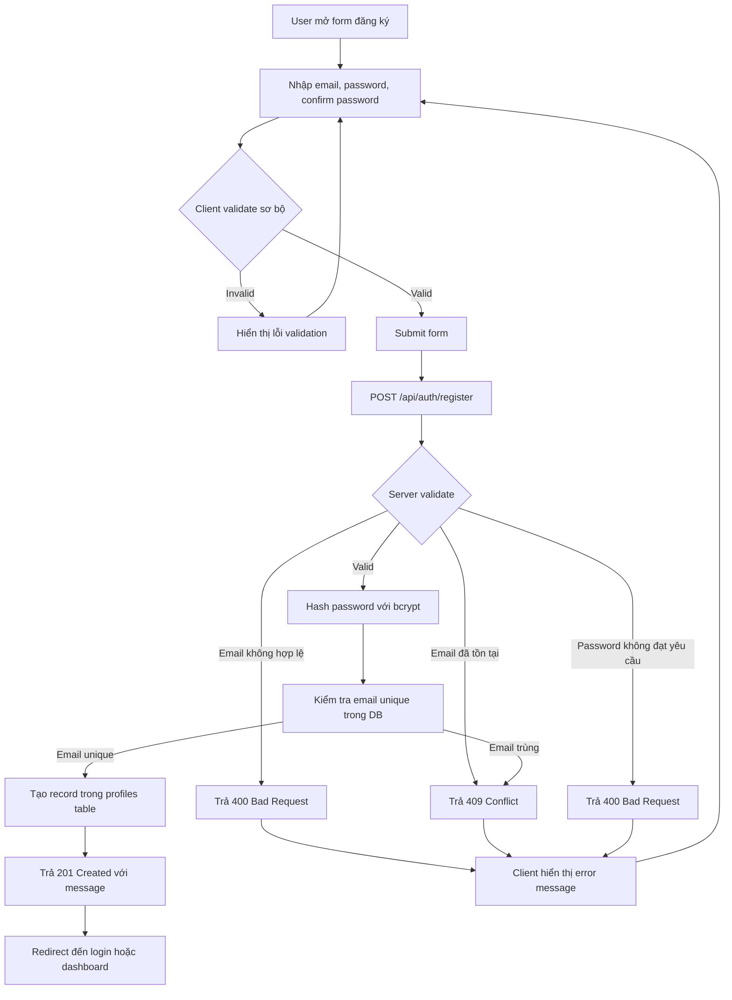
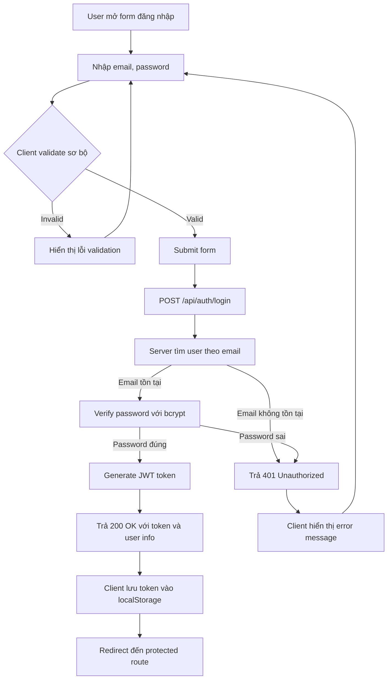
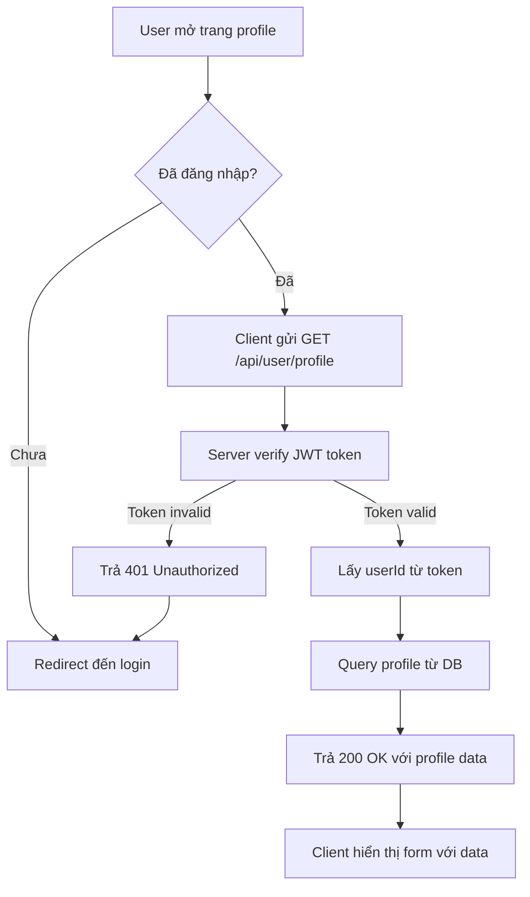
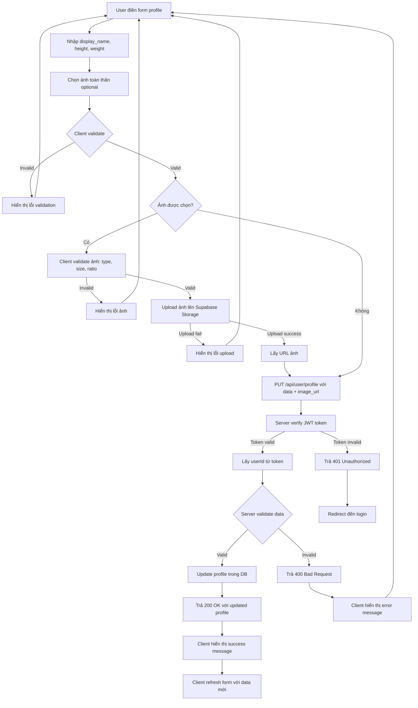
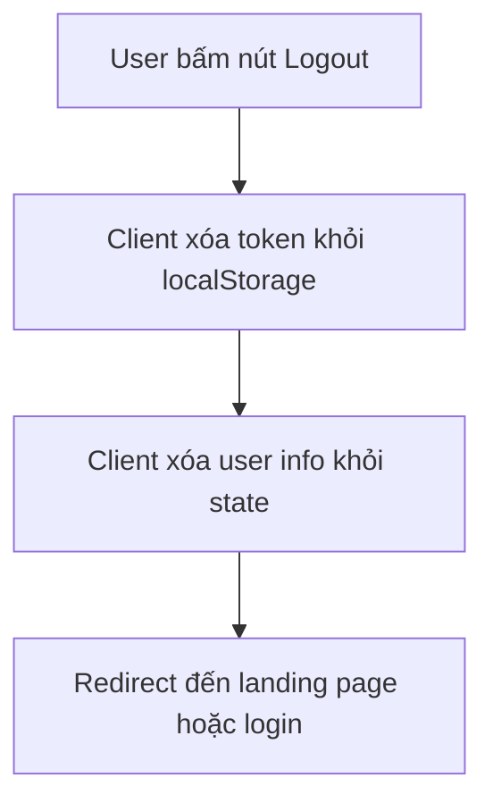
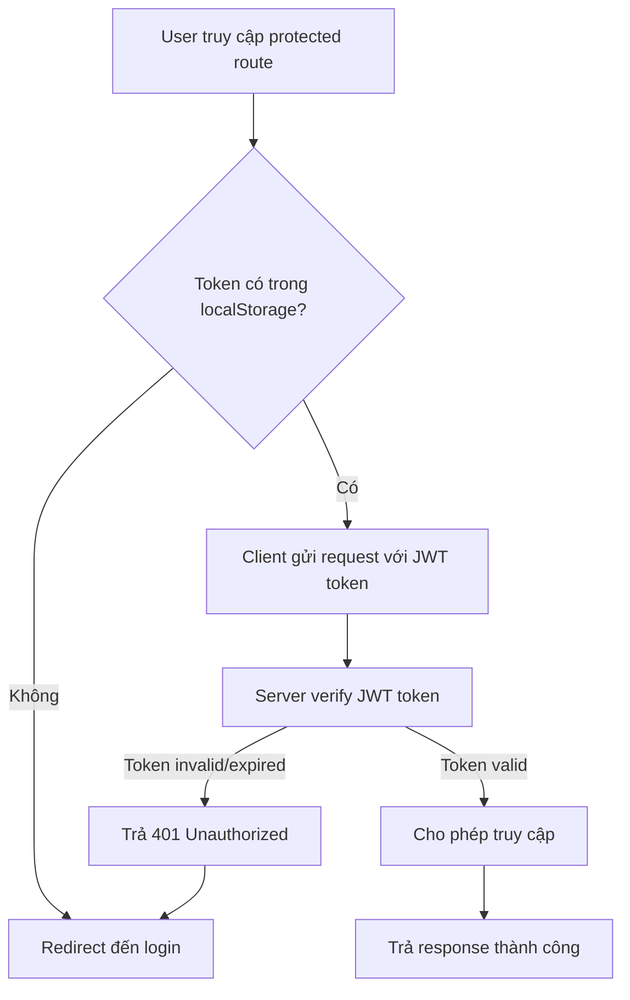
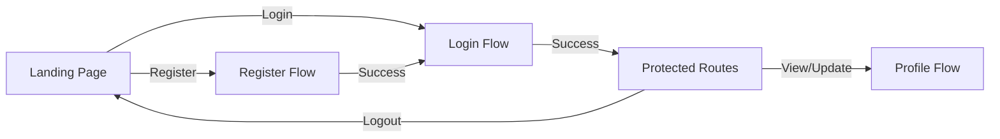

# Flow Design - Sprint 1

## Tổng quan
Tài liệu này mô tả các flow chính cho Sprint 1, bao gồm authentication (US-01) và profile management (US-02).

## 1. Register Flow (US-01)

### Mô tả
Luồng đăng ký tài khoản mới bằng email và mật khẩu.

### Flow Diagram

### Các bước chi tiết
1. User mở form đăng ký
2. Nhập email, password, confirm password
3. Client validate sơ bộ (format email, độ dài password, password match)
4. Submit form → POST /api/auth/register
5. Server validate:
   - Email format hợp lệ
   - Email chưa tồn tại trong DB
   - Password đạt yêu cầu (min 8 ký tự, có chữ thường/hoa/số/ký tự đặc biệt)
6. Hash password với bcrypt
7. Tạo record trong profiles table (email lowercase, password_hash)
8. Trả response 201 Created
9. Client redirect đến login hoặc dashboard

### Error Handling
- Email trùng: 409 Conflict
- Email format sai: 400 Bad Request
- Password không đạt yêu cầu: 400 Bad Request
- Lỗi server: 500 Internal Server Error

---

## 2. Login Flow (US-01)

### Mô tả
Luồng đăng nhập bằng email và mật khẩu, trả về JWT token.

### Flow Diagram

### Các bước chi tiết
1. User mở form đăng nhập
2. Nhập email, password
3. Client validate sơ bộ (format email, password không rỗng)
4. Submit form → POST /api/auth/login
5. Server tìm user theo email (lowercase)
6. Verify password với bcrypt
7. Nếu đúng: Generate JWT token (với payload: userId, email)
8. Trả response 200 OK với token và user info
9. Client lưu token vào localStorage (hoặc cookie)
10. Redirect đến protected route (dashboard/profile)

### Error Handling
- Email không tồn tại: 401 Unauthorized
- Password sai: 401 Unauthorized
- Lỗi server: 500 Internal Server Error

---

## 3. Profile Get/Update Flow (US-02)

### Mô tả
Luồng lấy và cập nhật thông tin profile, bao gồm upload ảnh toàn thân.

### Flow Diagram - Get Profile

### Flow Diagram - Update Profile

### Các bước chi tiết - Get Profile
1. User mở trang profile
2. Client kiểm tra token trong localStorage
3. Nếu chưa đăng nhập → redirect đến login
4. Nếu đã đăng nhập → gửi GET /api/user/profile với JWT token trong header
5. Server verify JWT token
6. Lấy userId từ token payload
7. Query profile từ DB theo userId
8. Trả response 200 OK với profile data
9. Client hiển thị form với data

### Các bước chi tiết - Update Profile
1. User điền form (display_name, height, weight)
2. User chọn ảnh toàn thân (optional)
3. Client validate:
   - Height: số, 100-250
   - Weight: số, 30-250
   - Ảnh: jpg/jpeg/png, ≤ 5MB, ratio 3:4 hoặc 9:16
4. Nếu có ảnh: Upload lên Supabase Storage bucket `full-body-images`
5. Lấy URL ảnh từ Storage
6. Submit form → PUT /api/user/profile với data + image_url
7. Server verify JWT token
8. Lấy userId từ token
9. Server validate data (height, weight ranges)
10. Update profile trong DB
11. Nếu có ảnh mới và có ảnh cũ: Xóa ảnh cũ khỏi Storage
12. Trả response 200 OK với updated profile
13. Client hiển thị success message và refresh form

### Error Handling
- Token invalid/expired: 401 Unauthorized → redirect login
- Validation error: 400 Bad Request
- Upload error: 500 Internal Server Error
- Lỗi server: 500 Internal Server Error

---

## 4. Logout Flow & Protected Routes (US-01)

### Mô tả
Luồng logout và bảo vệ các routes yêu cầu đăng nhập.

### Flow Diagram - Logout

### Flow Diagram - Protected Routes

### Các bước chi tiết - Logout
1. User bấm nút Logout
2. Client xóa token khỏi localStorage (hoặc cookie)
3. Client xóa user info khỏi state/context
4. Redirect đến landing page hoặc login

### Các bước chi tiết - Protected Routes

#### Frontend Protection
1. Component/Route kiểm tra token trong localStorage
2. Nếu không có token → redirect đến login
3. Nếu có token → cho phép render component

#### Backend Protection (Middleware)
1. Request đến protected endpoint
2. Middleware kiểm tra JWT token trong header (Authorization: Bearer <token>)
3. Verify token với secret key
4. Nếu invalid/expired → trả 401 Unauthorized
5. Nếu valid → extract userId từ token và attach vào request
6. Cho phép request tiếp tục đến controller

### Protected Routes/Endpoints
- Frontend: `/profile`, `/dashboard` (nếu có)
- Backend: `/api/user/*` (tất cả endpoints liên quan đến user)

---

## Tổng hợp Flow Authentication

---

## Notes
- Tất cả các flow đều có error handling đầy đủ
- JWT token có TTL hợp lý (ví dụ: 7 ngày)
- Password luôn được hash trước khi lưu
- Email được normalize thành lowercase
- Storage bucket là private, chỉ user sở hữu mới truy cập được
- Client validate sơ bộ để giảm số lượng request không hợp lệ
- Server validate lại để đảm bảo security

